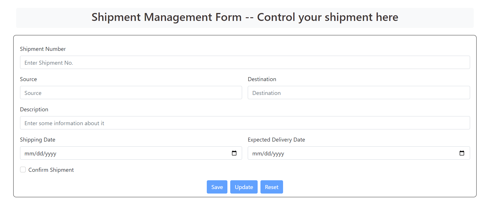

# **Shipment Stimulation using JsonPowerDB**

*Input Fields: {Shipment-No., Description, Source, Destination, Shipping-Date, Expected-Delivery-Date}

Primary key: Shipment No.

This project contain a form powered by json powerDB which helps in fast and efficient retrival of information from database*

## **Table of Contents**

1. [Description](#description)
2. [Benefits of Using JsonPowerDB](#benefits-of-using-jsonpowerdb)
3. [Release History](#release-history)
4. [Illustrations](#illustrations)
5. [Scope of Functionalities](#scope-of-functionalities)
6. [Examples of Use](#examples-of-use)
7. [Sources](#sources)

---

## **Description**

*Goals*   --    Reduce infrastructural cost and workload on Database servers

*Features*   --   Schecma Free , Muiltimode Database, A single Instance has million instances , Multinple security layers, NoSQL. 

## **Benefits of Using JsonPowerDB**

- High performance for read and write operations.
- Simplified database management with JSON-style storage.
- Real-time data processing capabilities.
- Easy to use with minimal setup requirements.
- In-built querying and analytics.

## **Release History**

| Version | Date       | Description                        |
|---------|------------|------------------------------------|
| v1.0.0  | 2024-09-08 | Initial release with basic features.|


## **Illustrations**

Below are some illustrations to help you understand the project better:

### **User Interface Overview**



## **Scope of Functionalities**

- User authentication and management.
- CRUD operations on data.
- Real-time data updates and notifications.
- Analytics and reporting tools.

## **Examples of Use**

```javascript
// Example of a Update operation using JsonPowerDB
function changeData(){
    var jsonchange = validateData()
    if(jsonchange===""){
        return 
    }
    var updreq = createUPDATERecordRequest(conToken,jsonchange,ShipDB,ShipRel,localStorage.getItem('rec'))
    $.ajaxSetup({async:false});
    var resjsonobj = executeCommandAtGivenBaseUrl(updreq,jpdbBaseUrl,jpdbIML)
    $.ajaxSetup({async:true});
    resetForm()
    $('#change').prop('disabled',true)
    $('#reset').prop('disabled',true)
    $("#shipno").focus()
}
```

## **Sources**

*https://login2explore.com/jpdb/docs.html*


